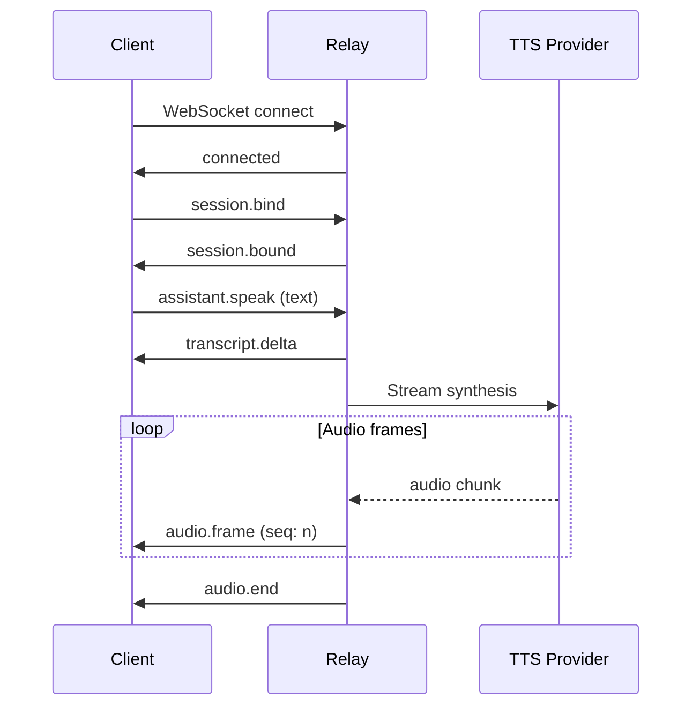

# WebSocket Voice Streaming Protocol

**Version**: `1.0.0`  
**Endpoint**: `ws://host:port/ws`

## Overview

Real-time bidirectional protocol for streaming TTS voice synthesis. Audio is delivered as small frames for immediate playback, NOT as complete audio files.

## Message Format

All messages are JSON over WebSocket text frames.

```typescript
interface Message {
    type: string;
    timestamp?: string; // ISO 8601
    // ... type-specific fields
}
```

---

## Client → Relay Messages

### `session.bind`

Bind a user/session to this WebSocket connection. Must be called before `assistant.speak`.

```json
{
    "type": "session.bind",
    "user_id": "user-uuid-here",
    "session_id": "session-uuid-here"
}
```

### `assistant.speak`

Request TTS synthesis for the given text. Audio will stream back as frames.

```json
{
    "type": "assistant.speak",
    "text": "Hello, I am JARVIS. How may I assist you today?",
    "voice_provider": "cartesia"  // optional: 'cartesia' | 'elevenlabs'
}
```

### `ping`

Keep-alive ping.

```json
{
    "type": "ping"
}
```

---

## Relay → Client Messages

### `connected`

Sent immediately after WebSocket connection established.

```json
{
    "type": "connected",
    "version": "1.0.0",
    "timestamp": "2024-12-22T10:00:00.000Z"
}
```

### `session.bound`

Confirmation of successful session binding.

```json
{
    "type": "session.bound",
    "user_id": "user-uuid-here",
    "session_id": "session-uuid-here",
    "timestamp": "2024-12-22T10:00:01.000Z"
}
```

### `transcript.delta`

Text content being spoken (for display sync).

```json
{
    "type": "transcript.delta",
    "text": "Hello, I am JARVIS.",
    "is_final": true,
    "timestamp": "2024-12-22T10:00:02.000Z"
}
```

### `audio.frame`

A single audio frame for immediate playback. Frames arrive in order.

```json
{
    "type": "audio.frame",
    "data_b64": "...",           // Base64-encoded audio bytes
    "codec": "pcm_16000",        // or "mp3"
    "seq": 0,                    // Sequence number for ordering
    "sample_rate_hz": 16000,     // Sample rate (e.g., 16000, 44100)
    "channels": 1,               // 1 = mono, 2 = stereo
    "timestamp": "2024-12-22T10:00:02.100Z"
}
```

**Codec Values**:
- `pcm_16000` – 16-bit PCM, 16kHz, mono (Cartesia, Mock)
- `mp3` – MP3 stream chunks, 44.1kHz, mono (ElevenLabs)

### `audio.end`

Signals completion of audio stream.

```json
{
    "type": "audio.end",
    "total_frames": 45,
    "provider": "cartesia",
    "timestamp": "2024-12-22T10:00:05.000Z"
}
```

### `provider.switched`

Provider failover occurred mid-stream.

```json
{
    "type": "provider.switched",
    "from": "cartesia",
    "to": "elevenlabs",
    "timestamp": "2024-12-22T10:00:03.500Z"
}
```

### `error`

Error response.

```json
{
    "type": "error",
    "code": "NOT_BOUND",
    "message": "Call session.bind first",
    "timestamp": "2024-12-22T10:00:02.000Z"
}
```

**Error Codes**:
- `INVALID_MESSAGE` – Malformed or unknown message type
- `NOT_BOUND` – `assistant.speak` called before `session.bind`
- `ALREADY_SPEAKING` – Previous speech still in progress
- `TTS_ERROR` – Voice synthesis failed
- `INTERNAL_ERROR` – Server error

### `pong`

Response to `ping`.

```json
{
    "type": "pong",
    "timestamp": "2024-12-22T10:00:00.500Z"
}
```

---

## Typical Flow



---

## Client Implementation Notes

### Audio Playback (Web)

```javascript
const audioContext = new AudioContext({ sampleRate: 16000 });
const frameQueue = [];

ws.onmessage = async (event) => {
    const msg = JSON.parse(event.data);
    
    if (msg.type === 'audio.frame') {
        const bytes = Uint8Array.from(atob(msg.data_b64), c => c.charCodeAt(0));
        
        if (msg.codec === 'pcm_16000') {
            // Convert to Float32 and schedule playback
            const samples = new Int16Array(bytes.buffer);
            const float32 = new Float32Array(samples.length);
            for (let i = 0; i < samples.length; i++) {
                float32[i] = samples[i] / 32768;
            }
            // Queue for playback...
        }
    }
};
```

### No Audio Files

This protocol streams raw audio frames. The client MUST:
- Buffer and play frames in real-time
- NOT save frames as files
- NOT offer download functionality

---

## Environment Variables

| Variable | Description | Default |
|----------|-------------|---------|
| `TTS_PROVIDER` | Primary TTS provider (`cartesia` or `elevenlabs`) | `cartesia` |
| `CARTESIA_API_KEY_MVP` | Cartesia API key | - |
| `CARTESIA_VOICE_ID_MVP` | Cartesia voice ID | - |
| `ELEVENLABS_API_KEY_MVP` | ElevenLabs API key (fallback) | - |
| `ELEVENLABS_VOICE_ID_MVP` | ElevenLabs voice ID (TTS endpoint) | `EXAVITQu4vr4xnSDxMaL` |
| `TTS_MOCK_MODE` | Enable mock TTS for testing | `false` |

> **Note**: `ELEVENLABS_AGENT_ID_MVP` is deprecated and no longer used. The ElevenLabs provider uses the standard TTS endpoint with `voice_id`, NOT the Agents Platform.

